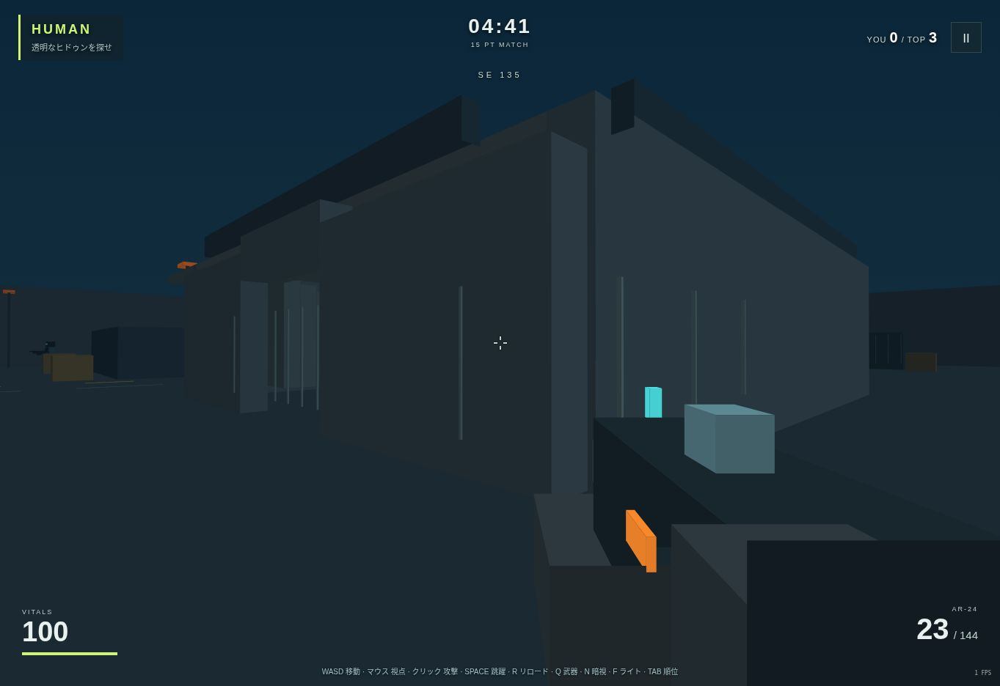

# ECHO HUNT 検証記録

検証日: 2026-10-07〜2026-10-08（日本時間）。公開先: https://hiroshi6844.github.io/test/echo-hunt/

## 実行済みの検証

| 環境 | 内容 | 結果 |
| --- | --- | --- |
| Linux / Node.js | `node --test tests/core.test.mjs` | 22件成功、失敗0件 |
| Linux / Mesa 25.2.8 / EGL OpenGL ES 3.2 | `python3 tests/verify_glsl.py` | GLSLコンパイル、リンク、描画、背景テクスチャのコピー、3段階の透明度が成功 |
| クラウドのChrome 154 / Canvas 3D補助描画 | 公開版 `73dab1c09e01` のブラウザ統合検証 | 19件成功、失敗0件 |
| Linux / Node.js | 120秒のBOT試合シミュレーション | 発砲119回、命中148回、撃破16回、ヒドゥン交代15回、復活15回、時間終了、ヒドゥン1名を維持 |

公開ページの通常プレイでも、開始ボタンでゲームが始まり、短いクリックで弾数が24発から23発に減ることを確認した。BOTが活動し、首位の得点が増える状態も画面で確認。Pagesの配信更新は成功。

ブラウザのUser-Agent: `Mozilla/5.0 (Macintosh; Intel Mac OS X 10_15_7) AppleWebKit/537.36 (KHTML, like Gecko) Chrome/154.0.0.0 Safari/537.36`。この識別文字列はSafari実機検証を意味しない。

## 基本テストの範囲

- 8名・ヒドゥン1名、開始時の役割選択、個人順位、目標点・時間による終了、再試合の状態リセット。
- 透明度を変えても同一の命中判定、友軍射撃無効、射撃と近接攻撃の壁による遮断。
- 銃3種の威力、射程、距離減衰、連射間隔、装填と予備弾、リロード。
- 人間のヒドゥン撃破3点と役割継承、安全地点への移動、ヒドゥン撃破1点、死亡と人間復活、自滅時の後継選択。
- 透明効果の低下、攻撃時露出、撃破時回復、出現保護と攻撃による解除。
- 懐中電灯と探知の射線、補給箱の取得・効果・再出現、裏切り者の攻撃対象と得点。
- BOTの限定視界と目撃記憶、経路の接続、実際の移動処理による両方の階段の登り・下り、壁とジャンプ。

## ブラウザ検証の範囲

公開ページの開始ボタンと実際の画面を操作して確認。開発用の `qa.html` は同じゲームをiframeで開き、入力イベントと状態・画素を確認する。通常ページでは開発用の状態操作インターフェースを公開しない。

- タイトルから開始、音声の開始操作による有効化、画面が単色にならないこと。
- 横844×縦390と横390×縦844の表示、回転案内、画面サイズ変更。
- 合成PointerEventによる3指同時の移動・視点・攻撃、pointerup / pointercancelの解除。
- リロード、武器切替、ヒドゥン開始、ナイトビジョン。
- 一時停止・再開、orientationchange、blur、pageshow後の入力解除。
- 結果の8名順位、再プレイの初期化、複数回開始後も描画ループが1本。
- 追加ルールの設定反映、読み込み失敗の原因表示。

PCキー操作、1フレームより短い攻撃タップ、人物・透明輪郭・透明度の画素変化も成功。描画テストは実際のキャンバス画素を比較し、人物とヒドゥンが表示されること、透明度の低下で画素が変化することを確認した。



## 未確認と制限

- iPhone / iPad実機のSafari、およびmacOS Safariは未確認。モバイル寸法と合成入力の検証は実機検証ではない。
- このクラウドブラウザはWebGLコンテキストを提供しなかったため、ブラウザではCanvas 3D補助描画を確認した。GPU版のGLSLは別途EGLで確認したが、実機SafariやChromeのWebGL描画を確認したという意味ではない。
- クラウドブラウザは描画が抑制されるため、モバイル端末でのFPS・発熱・電池消費は測定していない。実機ではまず画質「軽量」を選ぶ。
- 実際の音声出力機器での左右定位の聴感評価、iOSの割り込み復帰、実指による長時間マルチタッチは未確認。

## 再現方法

```sh
python3 build.py
node --test tests/core.test.mjs
python3 tests/verify_glsl.py
python3 -m http.server 8080
```

`http://localhost:8080/qa.html` を開き「ブラウザ検証を実行」。GPUテストにはMesa/EGL/GLESの共有ライブラリが必要。ゲーム自体は外部依存なし。
